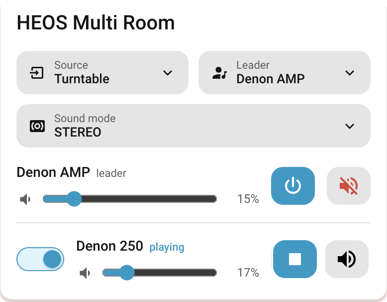
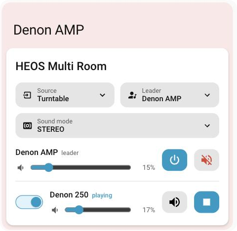

# HEOS Multiroom Card

One-card multi-room audio control for Home Assistant, built for a HEOS group leader (e.g. a Denon AVR playing a turntable or CD) streaming to HEOS room speakers. Pick the AMP's source, add or remove rooms with a toggle, and control every volume — without leaving the card.

Born of a real frustration: the HEOS app regularly forms a group from an analogue source but the follower never starts streaming, needing a remove/re-add and a manual play. This card pairs with a small Home Assistant script that automates that dance, so adding a room *just works*.

<p>
  
  
</p>

*Mid-vinyl-session: the AVR leads on Turntable and is muted locally (red) while the Denon 250 plays the stream in the dining room — receiver power and sound mode one tap away.*


## Features

- **Switchable group leader** — configure a pool of players; any of them can lead (an AVR's turntable, a speaker's AUX/USB input). Tap the leader name to hand leadership to another unit; the card also live-detects groups formed in the HEOS app (HA lists the leader first in `group_members`). Switching leader dissolves the current group first.
- **Source picker** — dropdown of the current leader's sources, optionally filtered to the ones you actually use (hide that Cameras input).
- **Receiver companion controls** — link a player to its AVR entity (e.g. Denon receivers expose a second, richer entity via the denonavr integration) and the card gains a power button and a Sound mode dropdown (Stereo, Pure Direct, Movie…) whenever that player leads.
- **One-click join-script setup** — the editor offers a button that creates the server-side companion script for you (admin users). No YAML, no docs detour.
- **Per-room join toggles** — flip a room on and it joins the leader's group (via the join script for reliable analogue streaming, or plain `media_player.join`); flip it off to unjoin. Rows expand with controls only when a room is active.
- **Per-device volume and mute** — every row (leader included) has its own slider and mute button; mute the leader locally while its source keeps streaming to the rooms.
- **Play/stop per room** — nudge a stubborn follower without opening the HEOS app, with a highlighted button and "playing" tag while a room is live.
- **GUI editor** — leader, rooms, source filter (populated live from the leader's `source_list`), join script, names, and styling all configurable without YAML.
- **Three style modes** — default (native theme), apply any installed theme to just this card (with gradient swatch picker), or manual gradient colours.

## Installation

### HACS (recommended)

1. HACS → three-dot menu → Custom repositories
2. Add `https://github.com/mycrouch/heos-multiroom-card` as type **Dashboard**
3. Search for "HEOS Multiroom Card" and download
4. Hard-refresh your browser

### Manual

Download `heos-multiroom-card.js` to `/config/www/` and add it as a dashboard resource (`/local/heos-multiroom-card.js`, type module).

## Configuration

Everything is configurable in the GUI editor. YAML equivalent:

```yaml
type: custom:heos-multiroom-card
players:                                  # the pool — any of these can lead
  - media_player.denon_amp_2
  - media_player.dining_room
  - media_player.master_bedroom
default_leader: media_player.denon_amp_2  # who leads when no group is active
name: AMP Multi-room                      # card title
join_script: script.heos_join_room        # created by the editor button
sources:                                  # optional filter of source_list
  - Turntable
  - CD
  - TV
names:                                    # optional display overrides (YAML only)
  media_player.dining_room: Dining
avr_entities:                             # optional receiver companions
  media_player.denon_amp_2: media_player.denon_amp
```

| Option | Default | Description |
|---|---|---|
| `players` | required | Pool of grouping-capable `media_player`s — leader candidates and rooms |
| `default_leader` | first player | Who leads when no group is active (the card live-detects the actual leader of any active group) |
| `name` | `Multi-room Audio` | Card title |
| `join_script` | none | Script called with `leader:` + `room:` to join reliably; falls back to `media_player.join` |
| `sources` | all | Subset/order of the leader's `source_list` to show (ignored for leaders it doesn't match) |
| `names` | friendly names | Per-player display name overrides |
| `avr_entities` | none | Map of player → its receiver entity (e.g. from the denonavr integration). When that player leads, the card adds a receiver power button and a Sound mode dropdown |
| `sound_modes` | all | Map of player → sound modes to show. Integrations offer generic model lists; use this to hide modes your receiver ignores |
| `theme` | none | Apply an installed theme to this card only |
| `gradient` | none | `[from, to]` manual gradient colours |

Legacy v1.0/1.1 options `entity`, `rooms`, `amp_name` and `room_names` keep working as silent aliases.

### The join script

For network sources plain `media_player.join` is fine. For analogue sources (turntable/CD) HEOS followers often join silently; the companion script joins, verifies playback, presses play, and re-joins if needed. **Click "Create join script" in the card editor to set it up in one click** — or create it manually from [`examples/stream_amp_to_room.yaml`](examples/stream_amp_to_room.yaml).

## Notes

- **AVR input sharing is tied to the main zone** (verified on a Denon AVR-S650H): the receiver streams *whatever its main zone is switched to*, and changing its source cuts/retunes what remote players receive. You cannot play the AVR's CD locally while streaming its turntable elsewhere. Practical upshot: lead with the AVR for AVR inputs (mute its row if you don't want it audible locally — the stream keeps flowing), and use the per-leader source filters so each leader only offers inputs it actually owns. HDMI-based AVR sources generally can't be shared to other players at all.
- Room join state is read from the leader's `group_members`, so groups formed in the HEOS app show correctly here too.
- HEOS speakers expose play/stop (not pause) for grouped analogue streams — the room button reflects that.
- The all-rooms slider sets each member to the same level (leader included).

## Related projects

| Repo | What it is |
|---|---|
| [airtouch-card](https://github.com/mycrouch/airtouch-card) | AirTouch 4/5 console-style AC + zone control |
| [sensibo-thermostat-card](https://github.com/mycrouch/sensibo-thermostat-card) | Thermostat-style Sensibo card |
| [ecovacs-vacuum-card](https://github.com/mycrouch/ecovacs-vacuum-card) | Ecovacs/Deebot control card |
| [gradient-themes](https://github.com/mycrouch/gradient-themes) | 40 gradient dashboard themes |

## License

MIT © Jason Crouch. Icons are Material Design Icons (Apache 2.0) rendered via `ha-icon`.
